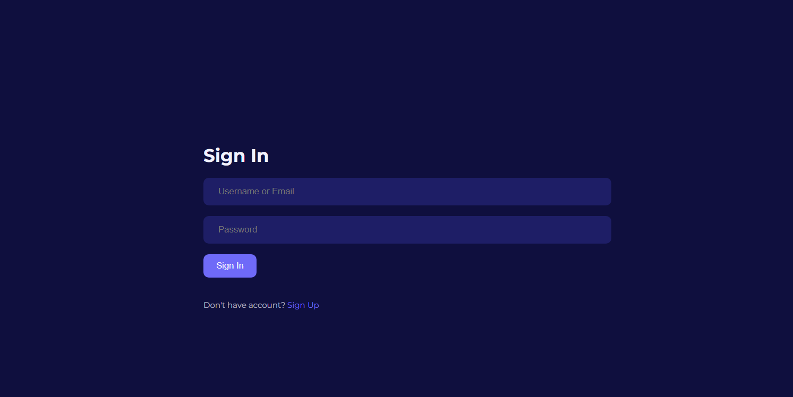
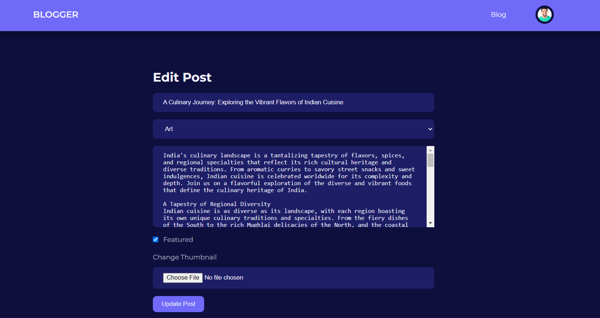

# Responsive Blog Website 📰

A **responsive blogging platform** built using **PHP, MySQL, HTML, CSS, and JavaScript**.  
This project enables users to create, edit, and manage blog posts with an intuitive dashboard,  
while ensuring mobile-friendly and device-adaptive design.

---

## 📖 Table of Contents
- [Introduction](#introduction)
- [Features](#features)
- [Screenshots](#screenshots)
- [Tech Stack](#tech-stack)
- [System Requirements](#system-requirements)
- [Database Setup](#database-setup)
- [Project Setup](#project-setup)
- [Future Scope](#future-scope)

---

## 🔰 Introduction
The aim of this project is to develop a **modern, user-friendly, and responsive blogging website**  
that provides individuals with a platform to express their thoughts, share information, and engage with a community.  

This website reduces the need for manual systems of maintaining blogs and instead provides  
a **dynamic platform** with seamless content creation, editing, and user management.

---

## ✨ Features
- **User Authentication**: Sign up, log in, and log out.
- **Dashboard**: Centralized management of posts, categories, and users.
- **Search Functionality**: Search blogs by title, author, or category.
- **Manage & Add Posts**: Create, edit, and delete blog posts.
- **Manage & Add Users**: Admin can manage users and assign privileges.
- **Manage & Add Categories**: Categorize blogs by tags and topics.
- **Responsive UI**: Mobile-friendly and adaptable across desktops, tablets, and smartphones.

---
## 📸 Screenshots

### Public Pages
| Home Page | Signup Page | Login Page |
|-----------|-------------|------------|
|  |  |  |

### Dashboard & Blog Management
| Dashboard | Add Post | Search Blogs |
|-----------|----------|--------------|
|  |  |  |  |

### Admin Features
| Manage Users | Manage Categories | Edit Post |
|--------------|-------------------|-----------|
|  |  |  |

## 🛠 Tech Stack
- **Frontend**: HTML, CSS, JavaScript  
- **Backend**: PHP  
- **Database**: MySQL (via phpMyAdmin)  
- **Server**: XAMPP / Apache  

---

## 🖥 System Requirements

**Software**  
- Operating System: Windows 10  
- Application Server: XAMPP / VS Code  
- Database: MySQL  

## 🗄 Database Setup
1. Open **phpMyAdmin**.  
2. Create a new database (e.g., `blog`).  
3. Import the SQL file provided:  

This will create the required tables:  
- `users`  
- `categories`  
- `posts`  

Got it 👍 let’s rewrite the **Setup section** to be super clear and beginner-friendly (no fluff, just exact steps to get it running).

---

### ⚙️ Project Setup (Improved)

1. **Clone the Repository**

git clone https://github.com/Intaza/BLOG.git
cd BLOG

2. **Import the Database**

   * Open **phpMyAdmin** in your browser: [http://localhost/phpmyadmin](http://localhost/phpmyadmin)
   * Create a new database (e.g., `blog`).
   * Go to the database → click **Import** → select `database/blog.sql` → click **Go**.

3. **Configure the Project**

   * Copy example config files and rename them:

     config/constants.example.php → config/constants.php
     admin/config/constants.example.php → admin/config/constants.php

   * Open both new `constants.php` files and update them with your database details.

4. **Move to XAMPP htdocs (if not already there)**

   * Place the whole `BLOG/` folder inside:

     C:\xampp\htdocs\

5. **Run the Project**

   * Start **Apache** and **MySQL** in XAMPP.
   * Open your browser and visit:
     [http://localhost/BLOG]

